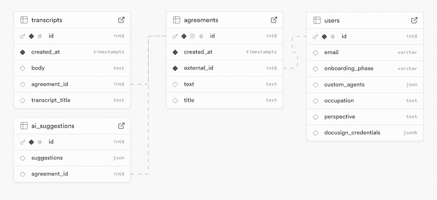

# Docuexpert

A hackathon project for Docusign.

Visit Devpost page : https://devpost.com/software/docuexpert

## What is it?
Docuexpert is a connector between Docusign CLM a meeting assistants. It contains experts (agents) which also comments on agreement and keep your todos organized.

## Structure

The project contains 3 applications;

- frontend : a web app lives inside Google Docs
- redirection-page : a simple page to store retrived accessToken for the user
- backend : functions and data storage layer

### Branches
- main : is the public version branch
- version : each version is merged here
- develop : each development committed here, sinve no need to diversify feature branches.

### Flow

End user uses 3 applications : Meeting Assistant, Docusign CLM (Google Docs*), and Docusign E-signature; which are shown at the top side of the diagram.

The systems utilizes, LLM (Claude), Supabase (Edge Functions, Tables and Easy Data API); whic are show at the bottom side of the diagram.


1. The systems gives an endpoint for an external meeting assistant like Fathom, to retrieve transcipts data.
2. frontend is a SPA which lives in a Apps Script container for Google Docs.
3. There is a **bridge** layer which links Google Apps Script "backend" layer to docuexpert frontend; which works in session, works with callback methods.
4. User can set preferences and customize experts (ai agents); and take some actions;
   1. get action items from transcripts, powered by LLM
   2. apply expert's suggestions with 1-click.
   3. send the last version of the agreement to recipient.
5. redirection page exists, because oauth tokenization cannot be whitelisted in dynamic origin urls. When a change is deployed on Apps Script the origin url might change. To to centralize token gathering, this page is prepared to hosted in a fixed origin.
6. AI suggestions is prepared by Claude, and carried by ai-service function.

*There are no API and sandbox environment provided fot CLM, so we used Google Docs for prototyping. A good AI tool can interoperate with others and can be deployed in many forms.

# Deployment

## Frontend

Local Development
```bash
cd frontend
npm install
#local development
npm run dev
```

Production
```bash
cd frontend
#dependencies
npm install

#build & sync tool for Apps Script
npm i -D @google/clasp @types/google-apps-script

#follow oauth login to Apps Script
clasp login
#local development
npm run publish
```
Change the project id and other environment keys before deploy.

And build redirection-page with `npm run build` command, then distribute files within your website.

## Backend

You can deploy per edge function to Supabase:

```bash
supabase functions deploy ai-service --project-ref <PROJECT_ID>
supabase functions deploy finalize-agreement --project-ref <PROJECT_ID>

```

**Database - Table Schemas**
